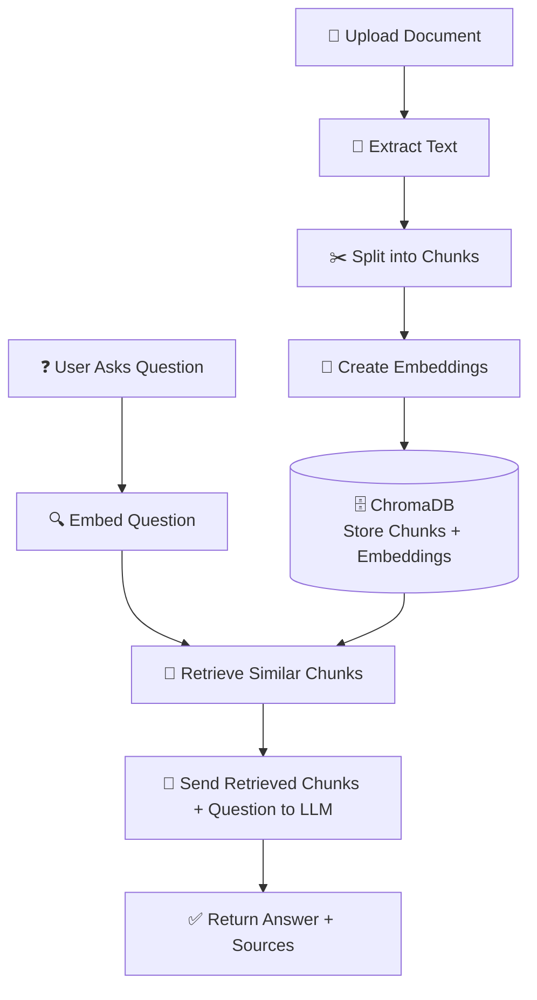

# RAG Pipeline
This includes Ingestion, Chunking, Embedding and Vector Storage.
Uses Open source LLM models with LangChain.

Uses uv for package management and development:
[UV reference link](https://docs.astral.sh/uv/)

## Run the server
```
uv run fastapi dev app/main.py
```

## Check the Data Flow and Services Details

[SERVICE SPEC](docs/SERVICE_SPEC.md)

## RAG Pipeline Workflow



## Screenshots

