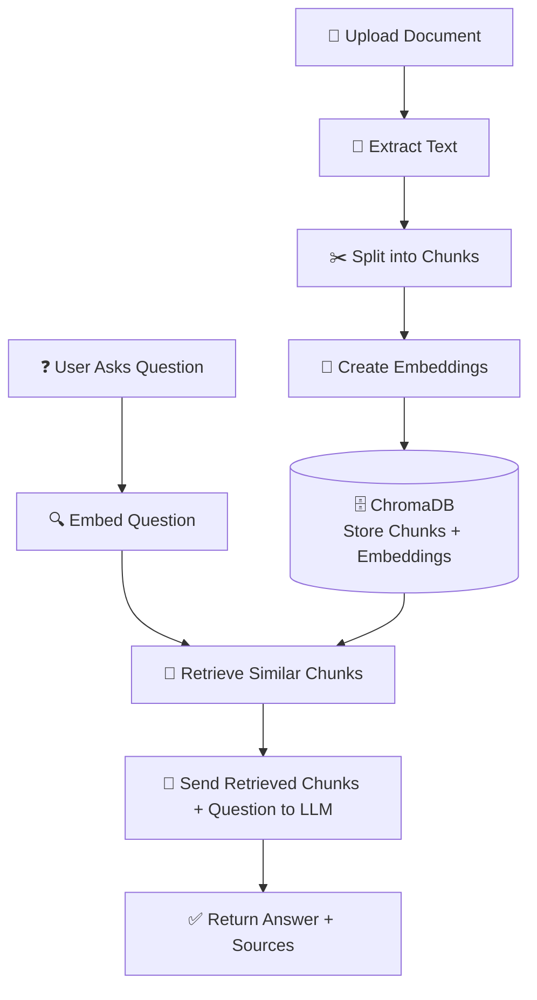
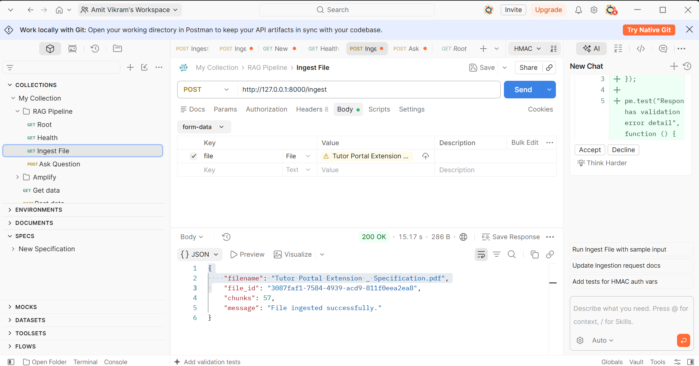
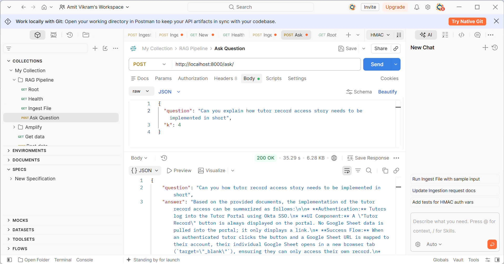

# RAG Pipeline
This includes Ingestion, Chunking, Embedding and Vector Storage.
Uses Open source LLM models with LangChain.

Uses uv for package management and development:
[UV reference link](https://docs.astral.sh/uv/)

- The default environment variables are defined in `.env.template`. For enhanced security:
  1. Copy `.env.template` to `.env`:
     ```bash
     cp .env.template .env
     ```
  2. Update sensitive information like API keys, secrets, and llm model in `.env`.

## Run the server
```
uv run fastapi dev app/main.py
```

## API Documentation
```
http://localhost:8000/docs
```

## RAG Pipeline Workflow



## Screenshots

