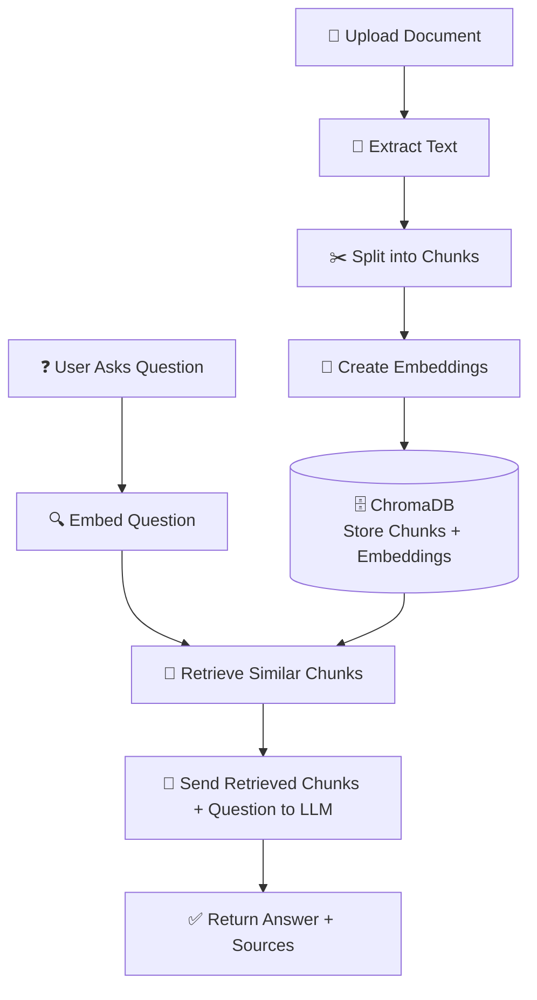

Uses uv for package management and development:
[UV reference link:-](https://docs.astral.sh/uv/)

## Run the server
```
uv run fastapi dev app/main.py
```
## RAG Pipeline Workflow


```mermaid
flowchart TD
    A[📄 Upload Document]
    B[📝 Extract Text]
    C[✂️ Split into Chunks]
    D[🧠 Create Embeddings]
    E[(🗄️ ChromaDB<br/>Store Chunks + Embeddings)]
    F[❓ User Asks Question]
    G[🔍 Embed Question]
    H[📑 Retrieve Similar Chunks]
    I[🤖 Send Retrieved Chunks + Question to LLM]
    J[✅ Return Answer + Sources]

    A --> B
    B --> C
    C --> D
    D --> E
    F --> G
    G --> H
    E --> H
    H --> I
    I --> J
```